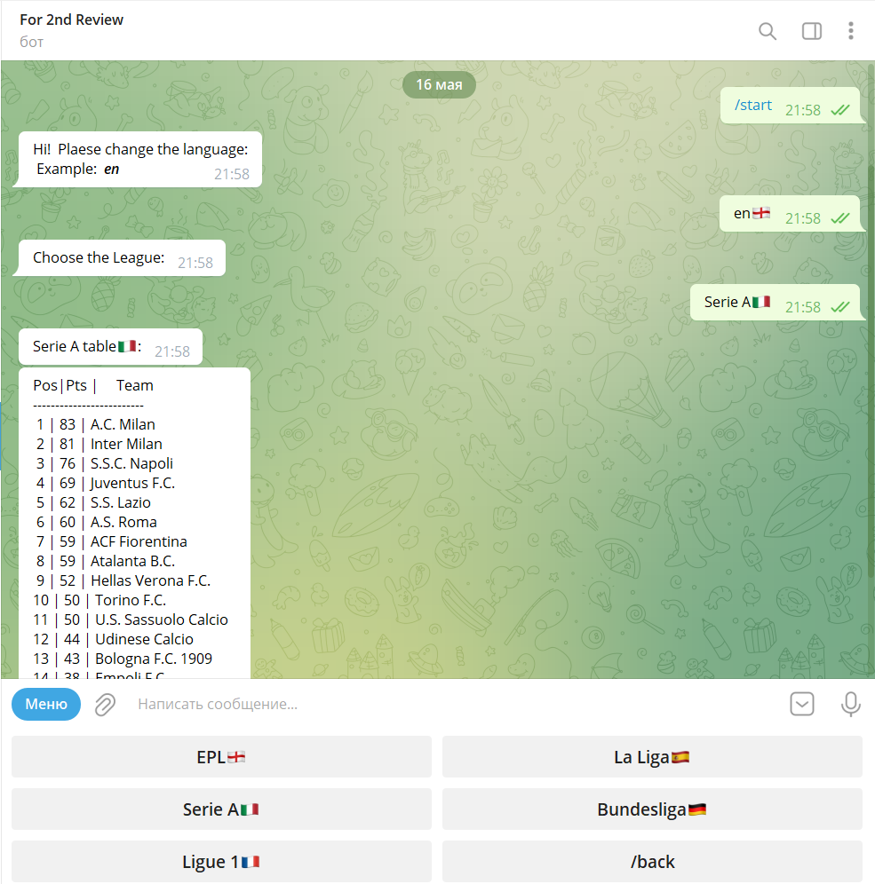

# myFirstTgBot

### Hello football fans👋.
This telegram bot is written in python, it is 
 available in more than 100 languages of the world.
It parses from the wiki site and shows you the 
 standings of the top 5 european football leagues. 
All you need to do is clone the branch, paste your 
token into the config.py folder and run via run.sh


#### Link for clonning:
```bash
git clone https://github.com/amonulloh/myFirstTgBot/tree/dev
```

##### Run:
```
./run.sh
```

##### Commands:
+ /start - start or restart bot
+ /back - go back to choose language

##### Links, which parced:
```bash
https://en.wikipedia.org/wiki/2021%E2%80%9322_Premier_League
https://en.wikipedia.org/wiki/2021%E2%80%9322_La_Liga
https://en.wikipedia.org/wiki/2021%E2%80%9322_Serie_A
https://en.wikipedia.org/wiki/2021%E2%80%9322_Ligue_1
https://en.wikipedia.org/wiki/2021%E2%80%9322_Bundesliga
```

<<<<<<< HEAD

### Some screenshots from bot:


The beginning of the bot.


Running time.


Another language.


Wrong штзгеы

>>>>>>>***Thank you very much, Regards Manuel***
=======
***Thank you very much, Regards Manuel***
>>>>>>> 6e339a3caffbab6f96c811d0a9a95105d906d4cb
